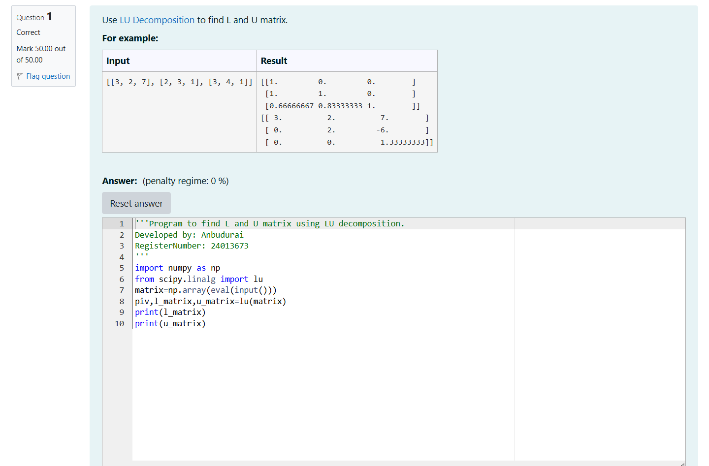
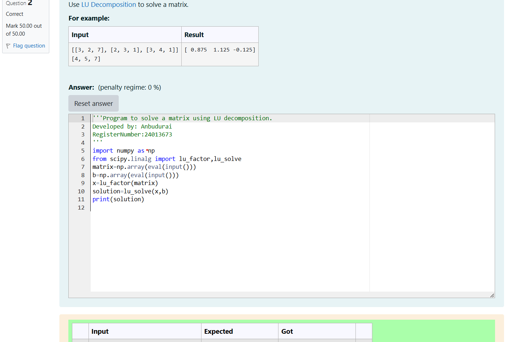

# LU Decomposition 

## AIM:
To write a program to find the LU Decomposition of a matrix.

## Equipments Required:
1. Hardware – PCs
2. Anaconda – Python 3.7 Installation / Moodle-Code Runner

## Algorithm
1.import the numpy module to use the built-in-functions for calculation 

2.from scipy.linalg import lu 

3.enter the lists from each linear equation and assign in np.array()

4.print L and U Matrix

5.end the program

## Algorithm for LU decomposition:

1.import the numpy module to use the built-in-functions for calculation 

2.from scipy.linalg import lu 

3.enter the lists from each linear equation and assign in np.array

4.using lu_solve(), we can find L and U matrix


## Program:
(i) To find the L and U matrix
```
/*
Program to find the L and U matrix.
Developed by: Anbudurai A
RegisterNumber: 24013673
*/
```
```
import numpy as np 
from scipy.linalg import lu
matrix=np.array(eval(input()))
piv,l_matrix,u_matrix=lu(matrix)
print(l_matrix)
print(u_matrix)
```
```
(ii) To find the LU Decomposition of a matrix

/*
Program to find the LU Decomposition of a matrix.
Developed by: Anbudurai A
RegisterNumber: 24013673
*/
```
```
import numpy as np 
from scipy.linalg import lu
matrix=np.array(eval(input()))
piv,l_matrix,u_matrix=lu(matrix)
print(l_matrix)
print(u_matrix)
```


## Output:




## Result:
Thus the program to find the LU Decomposition of a matrix is written and verified using python programming.

